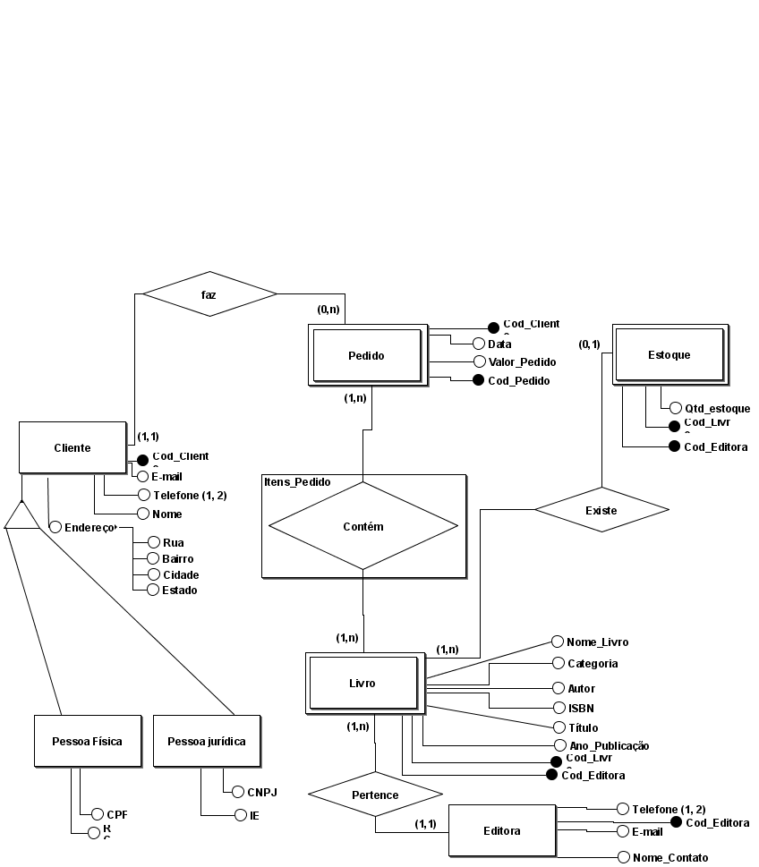

<h1> Estudando Modelagem de Banco de Dados </h1>
 
<h2> Projeto:  </h2>

 Banco de Dados para um E-commerce de Livros chamado Read+ 
 
 

 Utilizei o app <a href ="https://github.com/ajunior/brmodelo-installer">BrModelo</a> para desenhar o DER (DIAGRAMA ENTIDADE RELACIONAMENTO)  

  
<h3> Modelo Conceitual: </h3>
  

<h3> Modelo Lógico: </h3>
  

<h3> Modelo Físico: </h3>
  