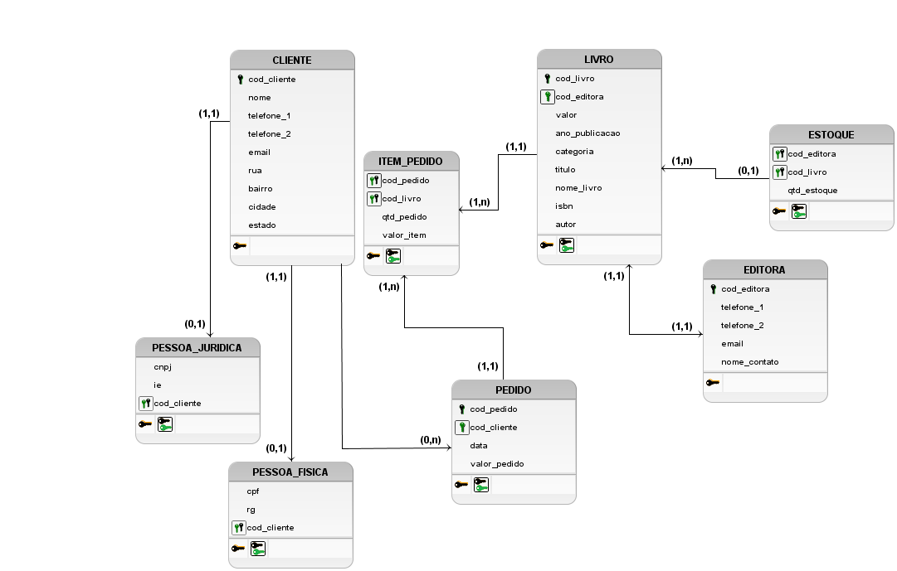

<h1> Studying Database Modeling </h1>
 
<h2> Project:  </h2>

 Database of an E-commerce book (Read+) 
 
 

  - I used the app <a href ="https://github.com/ajunior/brmodelo-installer">BrModelo</a> to draw the DER (ENTITY RELATIONSHIP DIAGRAM);  

  - I used the <a href ="http://www.bestofbi.com/page/architect_download_os">SQL Power Architect</a> app to make the physical model; 

  
<h3> Conceptual Data Model: </h3>
  

<h3> Logical Data Model: </h3>
  

<h3> Physical Data Model: </h3>
  
